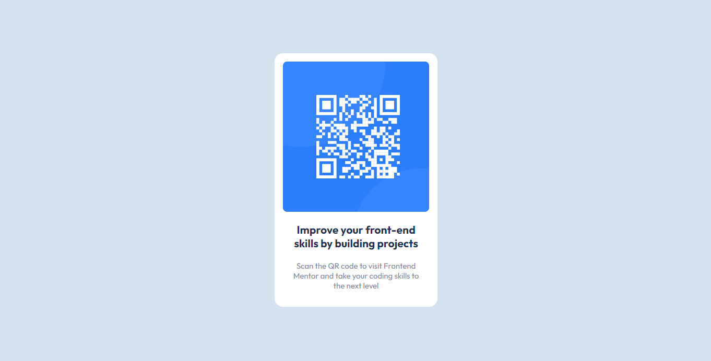

# Frontend Mentor - QR code component solution

This is a solution to the [QR code component challenge on Frontend Mentor](https://www.frontendmentor.io/challenges/qr-code-component-iux_sIO_H). Frontend Mentor challenges help you improve your coding skills by building realistic projects. 

## Table of contents

- [Overview](#overview)
  - [Screenshot](#screenshot)
  - [Links](#links)
- [My process](#my-process)
  - [Built with](#built-with)
  - [What I learned](#what-i-learned)
  - [Continued Development](#continued-development)
- [Author](#author)

**Note: Delete this note and update the table of contents based on what sections you keep.**

## Overview

### Screenshot



### Links

- Solution URL: [QR Code Component - Solution](https://github.com/mikrayall/qr-code-component/)
- Live Site URL: [QR Code Component - Live Site](https://mikrayall.github.io/qr-code-component.html)

## My process

### Built with

- Semantic HTML5 markup
- CSS custom properties
- Flexbox
- Mobile-first workflow

### What I learned

This was mainly a consolidation exercise of the html5 and CSS3 techniques which I have been learning recently

Initially the component would not center on the screen utilising

  ```css
  body{display:flex; justify-content:center; align-items:center;}
  ```
  
I had to add the collowing to the body:

  ```css
  height:100vh;
  ```

I assume this is due to me applying the display:flex to the body. Will clarify whether this is the case in the next project I undertake.

### Continued development

I'd like to further this project in the future, utilising JSON and Javascript to dynamically load the data displaying several QR Codes on the page at once.

## Author

- Frontend Mentor - [@mikrayall](https://www.frontendmentor.io/profile/yourusername)
